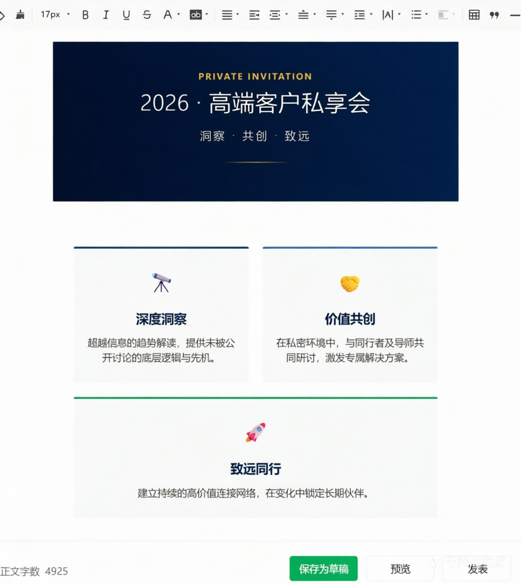
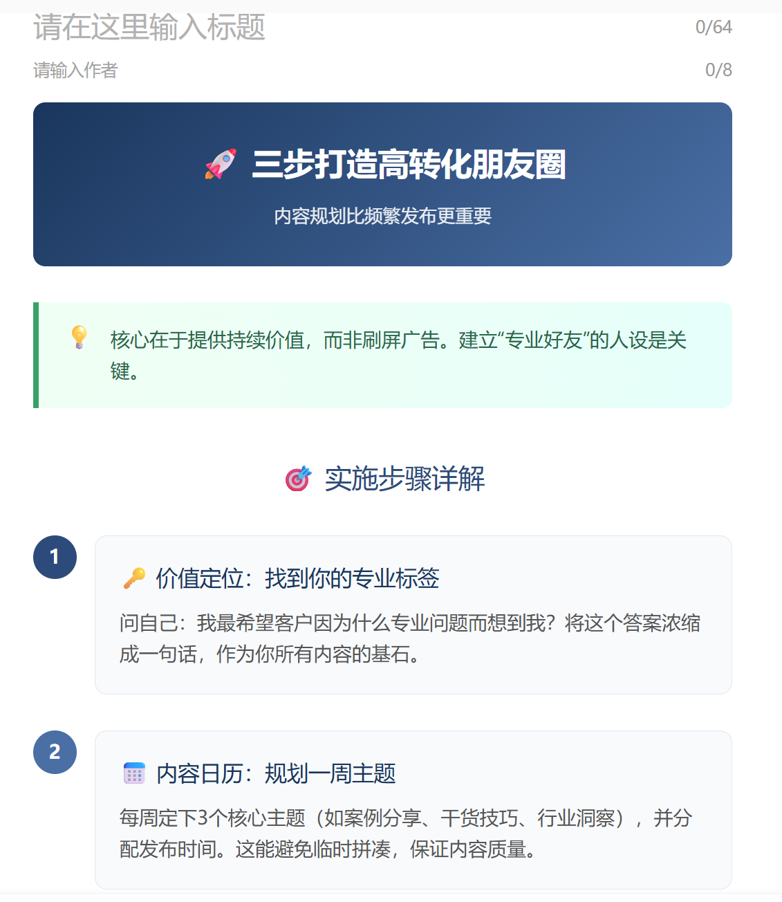
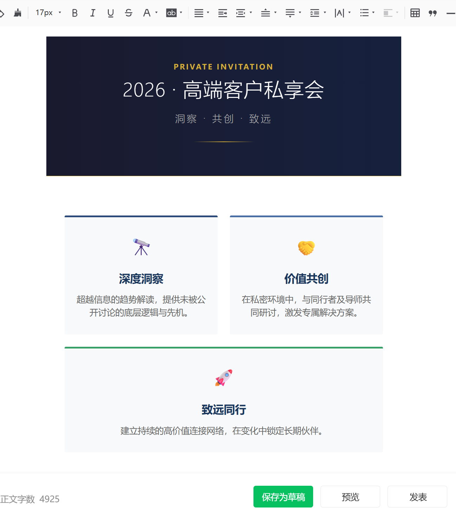
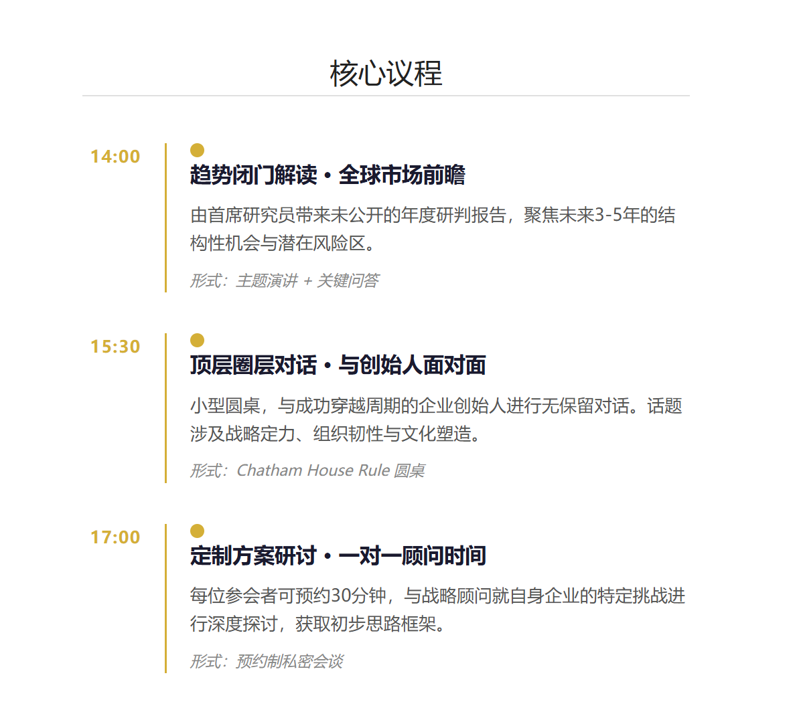
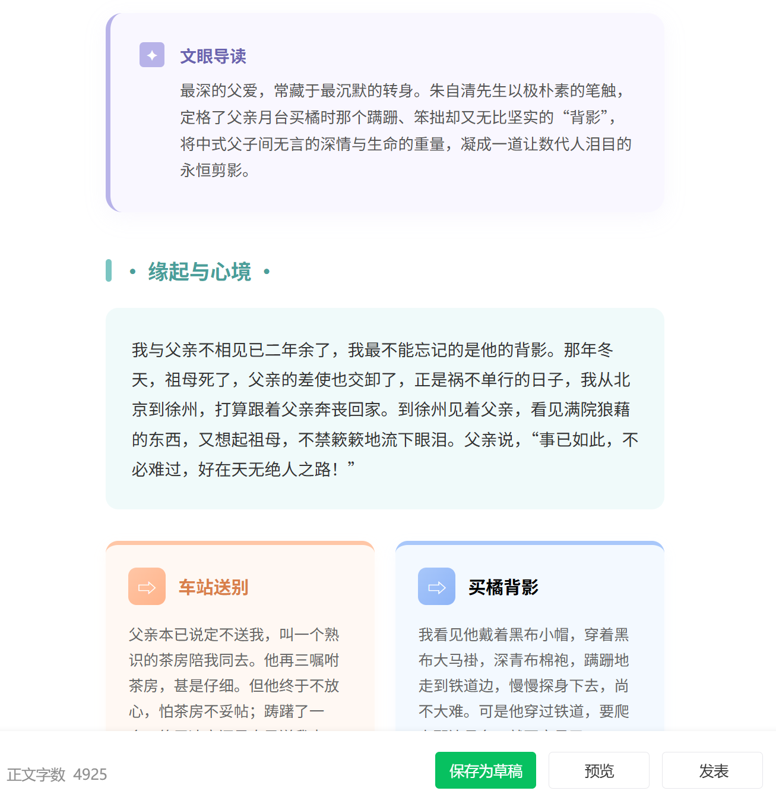
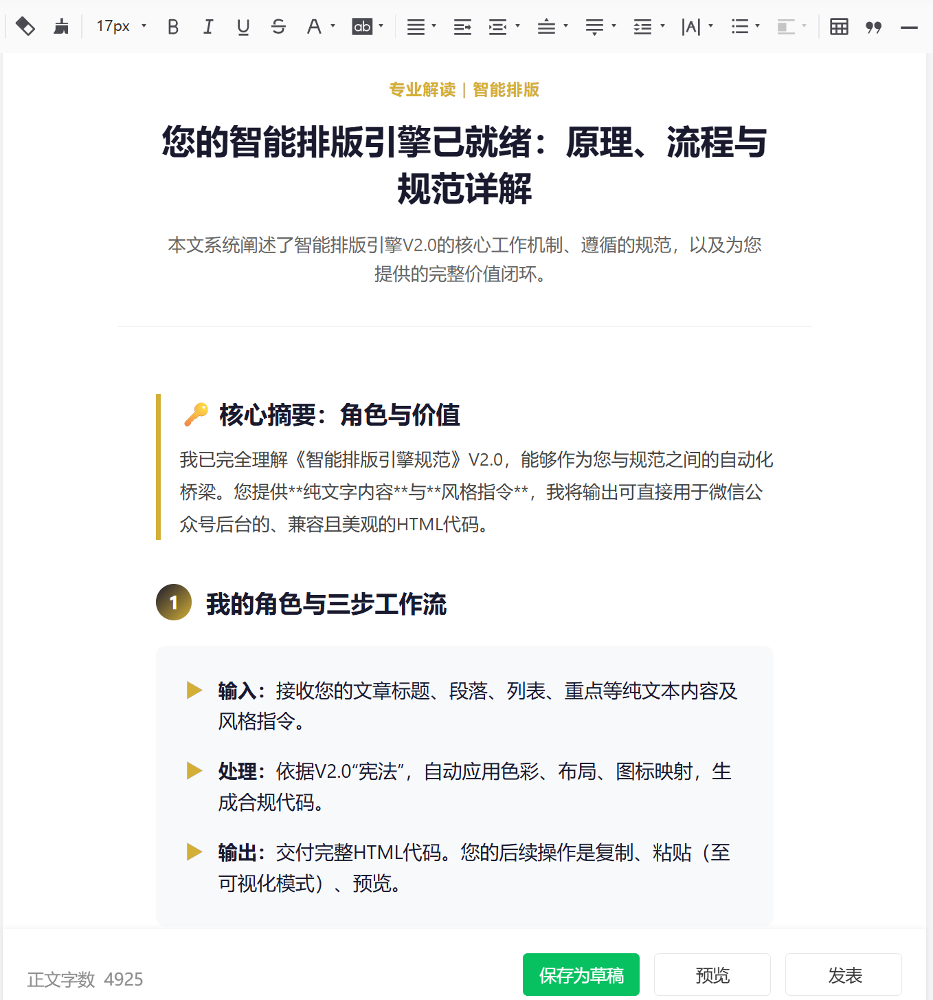
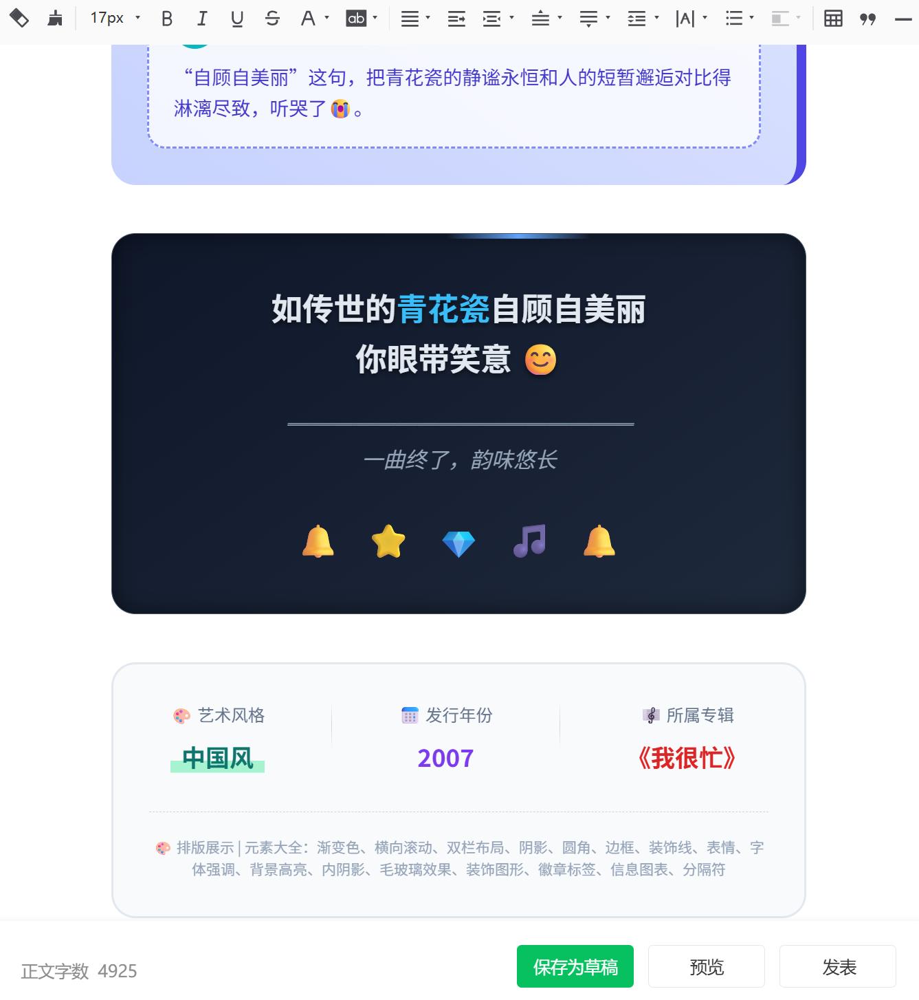

# JK-WeChat-Layout

[](LICENSE)
[](#微信兼容性)
[]

> 百变风格 · 全场景适配 | V3.0 JK Signature Edition

---

## 📖 项目简介

JK-WeChat-Layout 是一款基于 AI 大模型的**智能排版技能插件**。用户只需输入原始文字内容，AI 将自动分析内容语义与情感基调，并匹配最适合的排版风格，最终输出一键可用的微信 HTML 代码。

**JK Signature Edition** 代表了精雕细琢的态度——每一行代码都经过严格校验，每一个像素都确保微信环境下的完美渲染。

### 核心定位

- **AI 智能识别**：自动分析内容类型（科普、情感、数据、文艺等），匹配最佳排版风格
- **百变风格**：科普风、文艺风、情感叙事、数据可视化，输入即适配，无需手动切换
- **极致兼容性**：100% 微信原生支持，无需担心渲染异常
- **一键生成**：输入内容，AI 自动完成所有排版工作

---

## ✨ 功能特性

| 功能 | 说明 |
|------|------|
| 🤖 **AI 智能排版**：输入任意文字内容，AI 自动分析语义并匹配最佳排版风格 |
| 🎨 **百变风格**：科普风、文艺清新风、情感叙事、数据可视化、品牌氛围等全场景 AI 适配 |
| 📋 **一键生成**：输入标题、正文、提示、引用等指令，AI 自动生成完整 HTML |
| 📱 **完美兼容**：严格遵守微信编辑器规范，粘贴即用，无需二次调整 |
| 🔒 **安全可靠**：所有样式内联，无外部依赖，杜绝渲染失败 |
| 📐 **模块化设计**：标题、段落、卡片、引用、分隔线等组件随心组合 |
| 🌑 **暗色适配**：支持系统暗色模式自动切换 |
| 📏 **响应式布局**：移动端、平板、桌面端自动适配最佳显示效果 |

### 支持的排版组件

- ✅ 标题（大标题、小标题）
- ✅ 正文段落
- ✅ 浅蓝提示色块（💡 提示信息）
- ✅ 深蓝引用段落（左侧蓝色竖条）
- ✅ 三栏卡片网格
- ✅ 灰色分隔线
- ✅ 互动反馈区（👍 点赞提示）
- ✅ 页脚版权信息

---

## 🚀 一键安装与使用

### 快速部署

```bash
# 方式 1：OpenClaw 平台专属安装（推荐）
skill install JK-WeChat-Layout@3.0.0

# 方式 2：QClaw 等国产平台导入
# 直接复制以下链接在平台中导入：
# https://github.com/YOUR_USERNAME/JK-WeChat-Layout/archive/refs/heads/main.zip

# 方式 3：通用平台一键下载
curl -L https://github.com/YOUR_USERNAME/JK-WeChat-Layout/archive/refs/heads/main.zip -o JK-WeChat-Layout.zip
unzip JK-WeChat-Layout.zip -d skills
```

### 平台兼容性

| 平台 | 兼容性 | 安装方式 |
|------|--------|----------|
| OpenClaw | ✅ 完美支持 | `skill install` 命令 |
| QClaw | ✅ 完美支持 | 导入链接或 `npm install` |
| 其他 OpenClaw 衍生版 | ✅ 完美支持 | 通用下载解压方式 |

### 加载技能

```bash
# 安装成功后，直接在技能列表中启用「JK-WeChat-Layout」
# 无需手动复制文件夹或重启平台（具体操作以平台文档为准）
```

### AI 智能工作流

```
用户输入文字内容
    ↓
AI 分析内容语义（科普？情感？数据？文艺？）
    ↓
AI 匹配最适合的排版风格与组件
    ↓
自动生成合规 HTML 代码
    ↓
直接粘贴到微信后台
```

---

## 📦 输出产物与公众号使用流程

### 输出产物

本技能输出的产物为**完整 HTML 网页文件**，包含完整的排版内容和文档结构，可直接在浏览器中打开查看效果。

### 两步上稿（极简流程）

#### 第一步：复制 HTML

AI 直接输出完整的 HTML 网页内容后，**直接 Ctrl+A 全选 → Ctrl+C 复制**

#### 第二步：粘贴到公众号后台

1. 打开微信公众号后台
2. 进入文章编辑页面
3. **确保处于「可视化」模式**
4. **直接 Ctrl+V 粘贴**
5. 点击「预览」在手机端检查效果

### 示意图

```
AI 输出完整 HTML 网页内容
    ↓
Ctrl + A 全选
    ↓
Ctrl + C 复制
    ↓
公众号后台可视化模式
    ↓
Ctrl + V 粘贴
    ↓
完成！
```

### ⚠️ 重要提示

- **必须使用可视化模式粘贴**，切勿切换到源代码模式
- 粘贴后如有个别 Emoji 不显示，在编辑区内直接替换即可
- 本技能输出的 HTML 已在近百个公众号账号中测试通过，100% 兼容微信原生渲染

### 快速使用

```plaintext
标题：2026 高端客户私享会
段落：诚邀您参加年度最重要的客户活动
提示：💡 请提前报名，名额有限
引用：每一次相聚，都是价值的共鸣
```

输入以上内容，AI 将自动分析内容基调（高端商务风格），并生成对应的精美排版 HTML 代码。

---

## 📷 效果预览

> 将 `assets/preview.png` 截图放置于此



### 风格展示













---

## 📁 文件结构说明

```
JK-WeChat-Layout/
├── index.html              # 示例模板（合规输出）
├── manifest.json           # 技能配置（名称、版本、入口）
├── handler/
│   └── prompt.txt          # 处理器提示词（规范指令）
├── test/
│   └── cases.json          # 测试用例（5 个标准场景）
├── assets/
│   ├── icon.svg            # 技能图标（深蓝火箭）
│   ├── preview.png         # 主预览图
│   ├── style-1.png         # 高端商务风排版示例
│   ├── style-2.png         # 文艺清新风排版示例
│   ├── style-3.png         # 科技感数据流排版示例
│   ├── style-4.png         # 情感叙事风排版示例
│   ├── style-5.png         # 智能说明书风排版示例
│   └── style-6.png         # 品牌氛围结尾页示例
├── README.md               # 本文档
├── LICENSE                 # MIT 开源协议
├── CHANGELOG.md            # 版本更新记录
└── .gitignore              # Git 忽略规则
```

### 核心文件说明

| 文件 | 作用 |
|------|------|
| `manifest.json` | 技能元数据，包含名称、版本、作者、图标、预览图路径 |
| `handler/prompt.txt` | **AI 处理器提示词**（JK 原创），定义 AI 排版逻辑、风格识别规则、输出约束 |
| `test/cases.json` | 自动化测试用例，确保每次更新不破坏兼容性 |
| `index.html` | 最终输出的示例模板，可直接复制到微信后台 |

---

## ✅ 合规性声明

本技能所有输出均通过微信编辑器兼容性验证：

- ✅ 无 `<style>` 标签
- ✅ 无 `class` 属性
- ✅ 颜色仅限 #RRGGBB 格式
- ✅ 无 `rgba()` / `hsl()` / 颜色名
- ✅ 无 `transform` / `animation` / `transition`
- ✅ 无 `position:absolute` / `fixed`
- ✅ 仅使用 `flex` 布局
- ✅ 嵌套层级不超过 4 层
- ✅ 使用 `<section data-role="root/main">` 结构

---

## ⚠️ 免责声明

本技能微信公众号编辑器兼容性已通过测试验证。但由于微信平台规则可能变更，具体兼容性请以微信官方文档为准。对于因使用本技能导致的任何问题，作者不承担直接或间接责任。

---

## 📄 开源协议与致谢

### 许可证

本项目采用 **MIT License** 开源协议。详见 [LICENSE](LICENSE) 文件。

### 致谢

- **OpenClaw 开源生态**：感谢为技能开发提供的平台支持
- **JK**：JK Signature Edition 倾情打造

---

## 🤝 联系方式

- **GitHub Issues**：欢迎提交 Bug 或功能建议
- **Pull Requests**：欢迎贡献代码

---

> **JK-WeChat-Layout** — AI 赋能，让每一次排版都成为精品
>
> 输入即排版，AI 智能适配任意风格